<div align="center">

# ⚡ Automated Firebase CI/CD Pipeline
### Enterprise-Grade DevOps Automation for Serverless Applications


</div>

---

## 📖 Overview
This project demonstrates a **secure, production-ready DevOps pipeline** for deploying a serverless application. It moves beyond basic deployment to include security auditing, conditional build logic, and automated verification.

### 🏗️ System Architecture
The application leverages a serverless architecture to ensure high availability and zero maintenance.

```mermaid
graph LR
    User((User)) -->|HTTPS| CDN[Firebase Hosting<br/>(Frontend)]
    User -->|POST /sendmail| Func[Cloud Function<br/>(Backend)]
    
    subgraph Security Layer
    Func -->|Verify| Recaptcha[Google reCAPTCHA]
    end
    
    subgraph External Services
    Func -->|Dispatch| SendGrid[SendGrid API]
    end
    
    style CDN fill:#ffecb3,stroke:#ff6f00
    style Func fill:#e1f5fe,stroke:#0277bd
    style Recaptcha fill:#f5f5f5,stroke:#bdbdbd
    style SendGrid fill:#e8f5e9,stroke:#2e7d32
```

---

## 🚀 CI/CD Pipeline Logic
The core value of this repository is the **GitHub Actions Workflow** (`.github/workflows/firebase-functions-deploy.yml`), which orchestrates the entire software lifecycle.

```mermaid
graph TD
    Push[Code Push] --> Parallel{Run in Parallel}
    
    subgraph CI [Continuous Integration]
        Parallel --> Lint(Linting & Style)
        Parallel --> Audit(Security Audit)
        Parallel --> Test(Unit Tests)
    end

    Lint & Audit & Test --> Check{All Pass?}
    
    Check -- No --> Fail[❌ Stop Pipeline]
    Check -- Yes --> Build[Build & Optimize Assets]

    subgraph CD [Continuous Deployment]
        Build --> Env{Branch?}
        Env -- Main --> Prod[🚀 Deploy Production]
        Env -- PR --> Preview[👀 Deploy Preview Channel]
    end
    
    Prod --> Verify[🏥 Health Check]
    Verify --> Notify[🔔 Discord Notification]

    style CI fill:#f9fbe7,stroke:#827717,stroke-dasharray: 5 5
    style CD fill:#e3f2fd,stroke:#0d47a1
    style Verify fill:#fce4ec,stroke:#880e4f
```



---

## ✨ Key Features

| Feature | Description |
| :--- | :--- |
| **🧠 Smart Deployment** | Detects changes in `functions/` vs `public/` to only deploy what changed. |
| **🛡️ Security Gates** | Fails build on `npm audit` vulnerabilities or invalid secrets. |
| **👀 PR Previews** | Automatically deploys a temporary live link for every Pull Request. |
| **🤖 Bot Integration** | Comments on PRs with preview links & notifies Discord on status. |
| **🧪 Self-Healing** | Runs post-deploy `curl` health checks to verify site availability. |

---

## 📂 Project Structure

```bash
├── .github/workflows/   # ⚙️ CI/CD Definitions
├── functions/           # ⚡ Backend (Cloud Functions)
│   ├── index.js         #    - API Logic
│   └── package.json     #    - Backend Dependencies
├── public/              # 🎨 Frontend (Hosting)
├── test/                # 🧪 Automated Tests
├── firebase.json        # ☁️ Infrastructure Config
└── package.json         # 📦 Project Root
```

## 🛠️ Configuration

To replicate this pipeline, set these **GitHub Secrets**:

*   🔑 `FIREBASE_SERVICE_ACCOUNT_PROD`: Service Account JSON.
*   📧 `SENDGRID_API_KEY`: Email service API key.
*   🤖 `RECAPTCHA_SECRET`: Google reCAPTCHA secret.
*   🔔 `DISCORD_WEBHOOK`: URL for status notifications.

---
<div align="center">
  <sub>Designed & Built by <b>Tyler Fortune</b></sub>
</div>